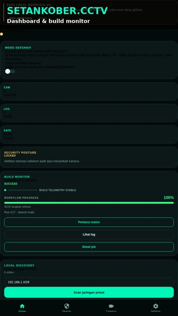

# Setankober.cctv

> **Setankober.cctv** adalah konsol Android dark cyber untuk audit jaringan lokal dan pemantauan CCTV berizin—dengan guardrail defensif, tanpa pemindaian internet publik, brute force, atau credential guessing.

| Fitur utama | Ringkasan |
|---|---|
| **Dashboard keamanan** | Status otorisasi, posture keamanan, kamera, audit log, dan kesehatan build dalam satu tampilan. |
| **Audit jaringan lokal** | Scan terbatas pada CIDR privat dengan progres, timeout, cancel, inventaris perangkat, dan pencatatan scope. |
| **Build Monitor GitHub** | Polling status workflow, persentase progres, langkah aktif, detail job, retry, dan tautan log build. |
| **Manajemen CCTV** | Simpan kamera milik pengguna secara lokal, validasi host privat, dan buka viewer stream sesuai dukungan perangkat. |
| **Alert & debugging aman** | Pesan error jelas, tombol retry, serta salin detail teknis yang menyamarkan URL, token, password, dan credential. |
| **Audit log & Safety Center** | Retensi lokal, ekspor metadata aman, privacy notice, dan panduan penggunaan berizin. |
| **APK GitHub** | Build native Gradle tanpa EAS, artifact APK, checksum SHA-256, dan release asset yang dapat diunduh. |

Setankober.cctv adalah aplikasi Android defensif untuk **audit jaringan privat dan pemantauan CCTV yang dimiliki atau telah diberi izin**. Aplikasi ini mengambil inspirasi dari dashboard keamanan pada video referensi, tetapi sengaja tidak menyediakan eksploitasi, bypass autentikasi, brute force, credential guessing, atau pemindaian internet publik.

## Fitur

| Fitur | Status |
|---|---|
| Dashboard status otorisasi dan ringkasan aset | Tersedia |
| Audit lokal berizin dan pencatatan scope | Tersedia |
| Penyimpanan kamera lokal | Tersedia |
| Validasi URL host privat | Tersedia |
| Viewer stream menggunakan expo-video | Tersedia; kompatibilitas RTSP bergantung pada device/player |
| Audit log lokal | Tersedia |
| Safety Center dan privacy notice | Tersedia |
| Sinkronisasi cloud | Tidak aktif secara default |

## Batas keamanan

Aplikasi ini hanya boleh digunakan pada jaringan, perangkat, dan kamera yang Anda miliki atau telah diberi otorisasi tertulis. URL yang disimpan divalidasi agar mengarah ke host privat. Jangan memasukkan alamat kamera pihak lain, jangan mencoba kredensial default, dan jangan menggunakan aplikasi untuk mengakses, meretas, mengganggu, atau merugikan pihak lain.

> Tampilan port atau RTSP handshake bukan bukti bahwa akses kamera sah atau berhasil. Selalu verifikasi kepemilikan dan izin secara terpisah.

## Menjalankan proyek

```bash
pnpm install
pnpm check
pnpm lint
pnpm test
pnpm dev:metro
```

## Build APK

Build APK sekarang memakai **native Gradle langsung di GitHub Actions tanpa EAS**. Setiap push ke `main` membangun debug APK dan checksum SHA-256. Setelah selesai, buka halaman workflow run dan unduh artifact `Setankober-cctv-debug-apk`. Tag `v1.0.0` menghasilkan rolling GitHub Release berisi APK debug/unsigned, file `.sha256`, dan changelog otomatis. APK ini ditujukan untuk pengujian perangkat dan bukan build production signed. Build lokal dapat dicoba dengan `cd android && ./gradlew assembleDebug`, tetapi runner GitHub direkomendasikan karena membutuhkan memori lebih besar.

## Demo video

Video explainer realistis HD menampilkan dashboard, audit jaringan lokal berizin, Build Monitor, detail job, alert error, salin detail teknis, kamera/viewer, Settings, instalasi APK, dan batas keamanan. Klik thumbnail untuk menonton atau mengunduh video dari GitHub Release.

[](https://github.com/kholqin/Setankober.cctv/releases/download/latest-debug/setankober-cctv-explainer-hd.mp4)

**[Tonton atau unduh video demo](https://github.com/kholqin/Setankober.cctv/releases/download/latest-debug/setankober-cctv-explainer-hd.mp4)** · **[Lihat semua asset release](https://github.com/kholqin/Setankober.cctv/releases/tag/latest-debug)**

## Struktur singkat

`app/(tabs)/index.tsx` berisi dashboard, `app/(tabs)/cameras.tsx` mengelola kamera yang ditambahkan pengguna, `app/camera-viewer.tsx` menampilkan viewer, sedangkan `lib/cctv-context.tsx` mengelola state dan penyimpanan lokal.

## Lisensi

Kode dirilis di bawah MIT License. Penggunaan aplikasi tetap tunduk pada hukum, privasi, dan kebijakan pemilik jaringan atau perangkat.

## Kontribusi

Pull request harus menyertakan pengujian yang relevan, tidak menambahkan kapabilitas eksploitasi, dan menjelaskan dampak privasi atau keamanan. Fitur jaringan baru harus bersifat non-destruktif, terbatas pada aset berizin, dan memiliki guardrail yang dapat diaudit.

## Status release signing

Atas permintaan pengelola, pipeline saat ini **tidak memakai signing secrets**. Tag versi seperti `v1.0.0` menghasilkan APK debug/unsigned yang aman untuk pengujian internal, checksum SHA-256, dan generated release notes. APK tersebut tidak boleh diperlakukan sebagai build production signed.

Jika signing production ingin diaktifkan pada masa mendatang, workflow dapat dikembalikan ke jalur keystore PKCS12 dengan empat repository secrets: `ANDROID_KEYSTORE_B64`, `ANDROID_KEYSTORE_PASSWORD`, `ANDROID_KEY_ALIAS`, dan `ANDROID_KEY_PASSWORD`. Jangan commit file keystore atau mencetak password ke log.
